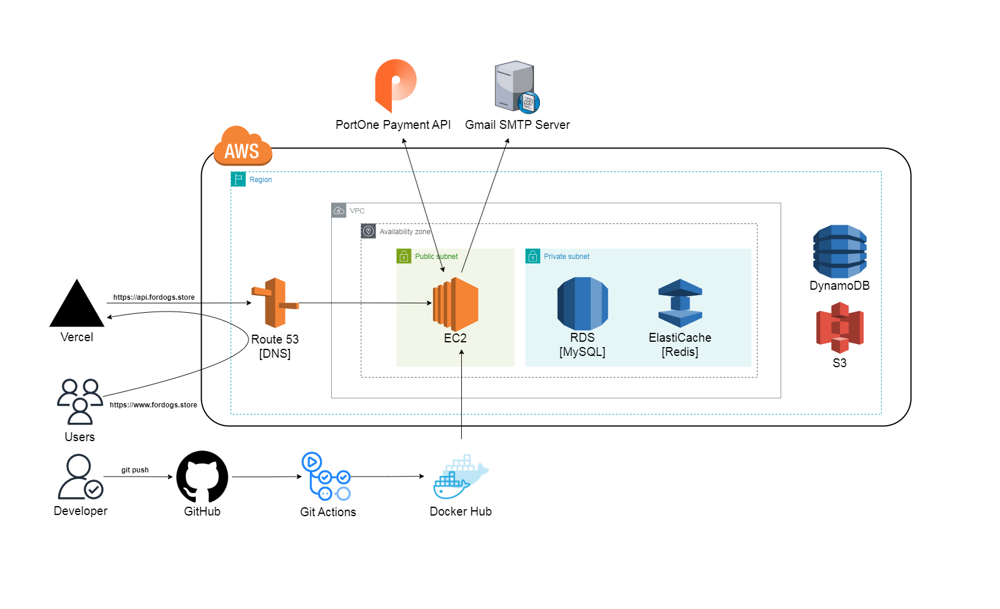

# For Dogs Service API

## Development

### Requirements
- Java >= 17ga
- docker >= 3

### Setup Keystore
To use HTTPS in the local environment of the project, you need to generate the `keystore.p12` file:
```bash
mkdir -p src/main/resources/ssl
keytool -genkey -storetype PKCS12 -keyalg RSA -keysize 2048 -keystore src/main/resources/ssl/keystore.p12 -validity 365
```

### System Architecture


### API Documentation
You can find the API documentation on Swagger by visiting the following links:
- **Local Environment**: [https://localhost/swagger-ui/index.html](https://localhost/swagger-ui/index.html)
- **Server Environment**: [https://api.fordogs.store/swagger-ui/index.html](https://api.fordogs.store/swagger-ui/index.html)

### Run
Using Docker Compose to start containers:
```bash
docker-compose up -d --force-recreate
```
Stopping services defined by Docker Compose:
```bash
docker-compose down -v
```
